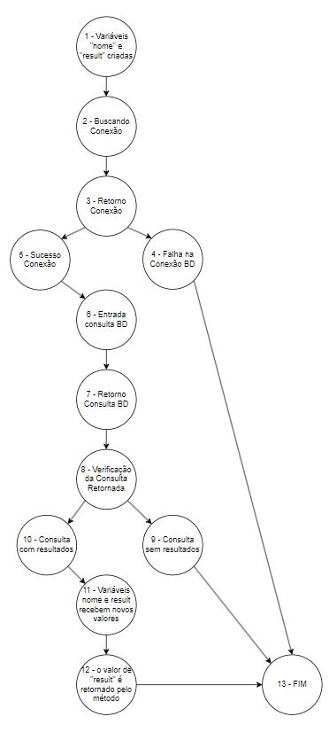

# Teste da Caixa Branca
Atividade da matéria "Qualidade e Testes de Software", onde sendo-nos apresentado determinado código, deverdeveríamos analisá-lo, apontando seus erros.

# ETAPA 1

## Do que se trata o Código?
O código apresentado se trata de uma classe "User" feita em Java, que tem como responsabilidade conetar-se ao banco de dados e autentificar o login de um usuário.
A classe conta com dois métodos, sendo eles:

- 'conectarBD()'
- 'verificarUsuario(String login, String senha)'

Além de duas variaveis que apesar de seremd declaradas fora dele, são utilizadas dentro do metodo 'verificarUsuario(String login, String senha)', sendo elas:

- String chamada de 'nome'.
- Variável booleana denominada 'result'

Caso a tentativa de login fosse bem sucedida, a variável nome guardava o nome do usuario e a variavel result armazenava o "sucesso" do login.

## Analisando o Código

###  Documentação
O código carece de documentação, comentários ou qualquer outra coisa que ajude a decifra-lo.

### Denominação de Variaveis e Métodos
Apesar de seguir o modelo camelCase, e a nomenclatura dos métodos estar em boas condições, os nomes definidos para as variaveis acabam sendo simples de mais, o que pode gerar confusões.

### Organização e Legibilidade do Código
A Organização E Legibilidade do Código não estão satisfatórias. Para torna-lo mais legível é importante ocasionais espaçamentos entre uma linha de código e outra, além da observância dos recuos adequados durante a estrutura do código.

### Tratamento de Nullpointers
Em momento algum do código se encontram tratamentos para valores nulos e mencionando o tratamento de erros, nenhum deles é propriamente descrito e tratado.

### Arquitetura
O código apresentado não parece ter uma organização bem definida, o que atrapalha a compreensão do mesmo. O que não demontra nenhuma observância quando a arquitetura mais adequada de um código.

### Conexões
Um ponto a ser salientado é que em momento algum do código as conexões criadas com o banco de dados são encerradas, o que configura um risco para a segurança do projeto, além de um gasto desnecessário de recursos da máquina.

# ETAPA 2

## Grafo de Fluxo

## Complexidade ciclomática 
- CC = (Arestas - Nós) + 2
- (14 - 13) + 2
- (1) + 2
- Complexidade Ciclomática = 3

## Caminhos
### Os caminhos possíveis são:
- Caminho 1 = 1; 2; 3; 4; 13.
- Caminho 2 = 1; 2; 3; 5; 6; 7; 8; 9; 13.
- Caminho 3 = 1; 2; 3; 5; 6; 7; 8; 10; 11; 12; 13.
